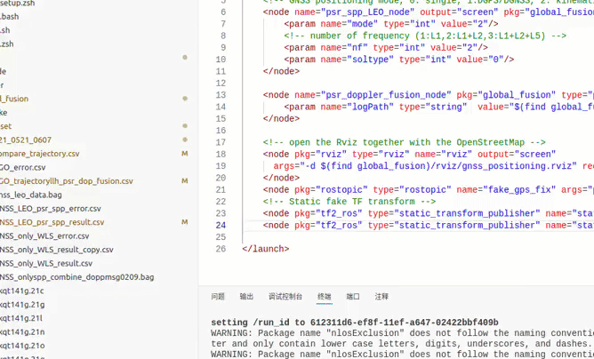

# GraphGNSSLib_LEO
### An Open-source Package for GNSS and LEO Coupled Positioning Using Factor Graph Optimization

This repository is the implementation of the open-sourced package, the GraphGNSSLib_LEO, which makes use of the LEO and GNSS coupled measurements to do positioning.

In this package, measured pseudorange and doppler shift of GNSS and simulated pseudorange and doppler shift of LEO satellites are used for positioning.  Measurements from the historical and current epochs are structured into a factor graph which is then solved by non-linear optimization. Positioning results from **single point positioning(SPP)** and **factor graph optimization (FGO)** method are compared. 

The package is based on **[GraphGNSSLib](https://github.com/weisongwen/GraphGNSSLib)**, adding modules to support simulated LEO satellites' measurements. This package is based on C++ which is compatible with the robot operation system (ROS) platform. Meanwhile, this package combines the RTKLIB (**[version: 2.4.3 b33](http://www.rtklib.com/)**) to read/decode the GNSS [RINEX](https://en.wikipedia.org/wiki/RINEX) files. Users from Robotics field can easily have access to GNSS raw data for further study.

**Important Notes**: 
  - Be noted that the **GNSS-only SPP** mentioned throughout the package means estimating the positioing of the receiver based on the GNSS pseudorange Doppler measurements uisng SPP.
  - Be noted that the **GNSS-LEO SPP**mentioned throughout the package means estimating the positioing of the receiver based on the GNSS and LEO pseudorange Doppler measurements uisng SPP.
  - Be noted that the **GNSS-LEO FGO** mentioned throughout the package means estimating the positioing of the receiver based on the combination of GNSS and LEO pseudorange and Doppler measurements uisng FGO.
 
**Authors**: [Yixin Gao](https://polyu-taslab.github.io/members/gao_yixin.html),[Weisong Wen](https://www.polyu.edu.hk/aae/people/academic-staff/dr-wen-weisong/), from the [Trustworthy AI and Autonomous Systems (TAS) Laboratory]([https://polyu-taslab.github.io/]), The Hong Kong Polytechnic University. 

**Related Papers:** 
  - Gao, Y., Wen, W., Liu, X., Huang F., Hu, J., & Su, D.(2025, Nov.) [Enhancing LEO-GNSS Positioning in Urban Canyons: A Factor Graph Optimization Approach with StarLink Simulaieeetions](https://its.papercept.net/conferences/scripts/abstract.pl?ConfID=91&Number=464). In 2025 IEEE 28th International Conference on Intelligent Transportation Systems (ITSC). IEEE

  - Wen, W., & Hsu, L. T. (2021, May). [Towards robust GNSS positioning and Real-time kinematic using factor graph optimization](https://ieeexplore.ieee.org/abstract/document/9562037). In 2021 IEEE International Conference on Robotics and Automation (ICRA) (pp. 5884-5890). IEEE. 

*if you use GraphGNSSLib_LEO for your academic research, please cite our related [papers](https://ieeexplore.ieee.org/abstract/document/9562037)*

<p align="center">
  
</p>

<center> Software flowchart of GraphGNSSLib_LEO, more information please refer to mannual and paper.</center>

## 0. Suggestion
If you are not familiar with ROS, we highly recommend using our docker container to enjoy GraphGNSSLib_LEO. For the details, please go to the branch docker [4. Docker Support](https://github.com/PolyU-TASLAB/GraphGNSSLib_LEO?tab=readme-ov-file#4-docker-support)


## 1. Prerequisites
### 1.1 **Ubuntu** and **ROS**
Ubuntu 64-bit 18.04, ROS Melodic. [ROS Installation](http://wiki.ros.org/ROS/Installation). We only test it on Ubuntu 18.04 with ROS Melodic. 

### 1.2. **Ceres Solver**
Follow the following instructions to install Ceres-solver instead of using the latest version of Ceres-solver.

**Step 1**: Download the [Ceres-solver](https://github.com/PolyU-TASLAB/GraphGNSSLib_LEO/blob/main/support_files) which is compatible with GraphGNSSLib_LEO. 

**Step 2**: make and install
```bash
sudo apt-get install cmake
# google-glog + gflags
sudo apt-get install libgoogle-glog-dev
# BLAS & LAPACK
sudo apt-get install libatlas-base-dev
# Eigen3
sudo apt-get install libeigen3-dev
# make Ceres-solver
mkdir ceres-bin
cd ceres-bin
cmake ../ceres-solver
sudo make -j4
sudo make test
sudo make install
```

### 1.3. **Extra Libraries**
```bash
sudo apt-get install ros-melodic-novatel-msgs
```
## 2. Build GraphGNSSLib_LEO
Clone the repository and catkin_make:
```bash
mkdir GraphGNSSLib_LEO/src
cd ~/GraphGNSSLib_LEO/src
mkdir result
git clone https://github.com/PolyU-TASLAB/GraphGNSSLib_LEO.git
cd ../
# if you fail in the last catkin_make, please source and catkin_make again
catkin_make
source ~/GraphGNSSLib_LEO/devel/setup.bash
catkin_make
```
(**if you fail in this step, try to find another computer with clean system or reinstall Ubuntu and ROS**)


## 3.Run GNSS-LEO positioning using dataset collected in Whampoa [UrbanNav-HK-Deep-Urban-1](https://github.com/IPNL-POLYU/UrbanNavDataset)   
The GNSS-LEO positioning via SPP and FGO is validated using static dataset collected near Whampoa of Hong Kong. Several parameters are as follows:
  - GPS second span: **455342** to **456880**
  - satellite system: **GPS/BeiDou/Stralink**
  - Window Size: **Batch**
  - measurements considered: pseudorange and Doppler measurements
  - result is saved by default
    ```c++
    $(find global_fusion)/dataset/2021_0521_0607/GNSSLEO__SPP_trajectoryllh_psr_dop_fusion.csv
    
    ```
 We provide some simulated LEO data, please enjoy it!
   ```bash
  source ~/GraphGNSSLib_LEO/devel/setup.bash
  # the GNSS-only SPP positioning result will be displayed in rviz
  roslaunch global_fusion data_Whampoa_20210521_GNSS_only.launch
  # You can record them as rosbag for usage in the following 
  rosbag record -a
  ```
  If you want to use the LEO-GNSS integrated data, you can launch with the following steps:
  ```bash
  source ~/GraphGNSSLib_LEO/devel/setup.bash
  # run pseudorange and doppler fusion
  roslaunch global_fusion data_Whampoa_20210521_GNSSLEO.launch
  # You can also record all the topic for the following evaluation
  rosbag record -a
  # read GNSS raw data, LEO raw data and combine them as ROS topic
  roslaunch global_fusion data_Whampoa_20210521_GNSSLEO.launch.launch
  ```

<p align="center">
  
</p>
<center>
The positioning results with different mathods are displayed in rviz.
</center>


  - GNSS only positioning using SPP with the blue arrow in topic **/gnss_preprocessor_node/WLSENURTKLIB** 
  The result is recorded in `GNSS_only_WLS_result.csv`
  - GNSS only positioning using RTK with the red arrow in topic **/gnss_preprocessor_node/ENUIntegerRTK**
  - GNSS and LEO positioning using SPP with the green arrow in topic **/WLS_spp_psr**
  The result is recorded in `GNSSLEO__SPP_trajectoryllh_psr_dop_fusion.csv`
  - GNSS and LEO positioning using FGO with purple curve in topic **/FGOGlobalPath**. 
  The result is recorded in `GNSSLEO_FGO_trajectoryllh_psr_dopp_fusion.csv`
  
Please modify the file path for the result to suit your requirements.

<p align="center">
  
</p>

Trajectories of three methods (GNSS-only SPP using pseudorange measurements with orange line, GNSS-LEO SPP positioning using pseudorange measurements with yellow line, and GNSS-LEO FGO positioning using pseudorange and doppler shift measurements with purple line. The x-axis and y-axis denote the east and north directions, respectively.


<p align="center">
  
</p>

Positioning Error of Different method: Orange dots from GNSS-only SPP, Yellow dots from GNSS-LEO SPP, Purple dots from GNSS-LEO FGO.

## 4. Docker Support
 To run GraphGNSSLib_LEO with docker, first make sure  [docker](https://docs.docker.com/install/linux/docker-ce/ubuntu/) are installed on your machine. If you want to use the docker to run the global_fusion:
```bash

cd ~/catkin_ws/src/GraphGNSSLib_LEO/docker
make build
sudo -E ./start.bash #Do not delete " -E "
source devel/setup.bash
# run pseudorange and doppler fusion
roslaunch global_fusion data_Whampoa_20210521_GNSSLEO.launch
# you should open another ternimal to enter the docker.
# read GNSS raw data and publish as ROS topic
roslaunch global_fusion leo_raw_publisher.launch
```

  Also, there is a [video](https://www.youtube.com/watch?v=WMM2de_SxTw) showing the demo after you have built the docker_file in the directory GraphGNSSLib/docker

  If you want to restart the container, please stop it first:
  ```bash
sudo ./stop.bash
#then restart it
sudo -E ./start.bash 
```
 The directory  ~/shared_dir is created to connect the container and the host . In the container, it is located at  ~/graph1/shared_dir, you can also download the code to shared_dir and compile the program in the container (Recommended for those who are interested in making changes to the source code)


## 5. Acknowledgements
We use [Ceres-solver](http://ceres-solver.org/) for non-linear optimization and [RTKLIB](http://www.rtklib.com/) for GNSS data decoding, etc. Some functions are originated from [VINS-mono](https://github.com/HKUST-Aerial-Robotics/VINS-Mono). The [rviz_satellite](https://github.com/nobleo/rviz_satellite) is used for visualization. We based GNSS FGO proposed in [GraphGNSSLib](https://github.com/weisongwen/GraphGNSSLib) for positioning.

If there is any thing inappropriate, please contact [Yixin GAO](https://polyu-taslab.github.io/members/gao_yixin.html) through yixin.gao@connect.polyu.hk or [Weisong WEN](https://weisongwen.wixsite.com/weisongwen) through welson.wen@polyu.edu.hk.

## 6. License
The source code is released under [GPLv3](http://www.gnu.org/licenses/) license. We are still working on improving the code reliability. 

For any technical issues, please contact Yixin GAO <yixin.gao@connect.polyu.hk>, from the [Trustworthy AI and Autonomous Systems (TAS) Laboratory]([https://polyu-taslab.github.io/]), The Hong Kong Polytechnic University. 

For commercial inquiries, please contact Weisong WEN <welson.wen@polyu.edu.hk>, from the [Trustworthy AI and Autonomous Systems (TAS) Laboratory]([https://polyu-taslab.github.io/]), The Hong Kong Polytechnic University. 
